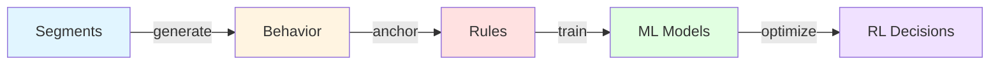

# 🧠 SEGMENT FOR DATASET
## Industry-Way Credit Scoring Segment Architecture

> [!IMPORTANT]
> Segments define behavioral diversity in synthetic credit data. They control **feature distributions only**, not labels, scores, or decisions. This approach mirrors how banks and bureaus construct training datasets.

---

## 📋 Table of Contents

- [What Are Segments?](#-what-are-segments)
- [Prime Segments (1-3)](#-prime-segments)
- [Near Prime Segments (4-5)](#-near-prime-segments)
- [Mid-Risk Segments (6-8)](#-mid-risk-segments)
- [Sub-Prime Segments (9-10)](#-sub-prime-segments)
- [Fraud Segments (11-13)](#-fraud-segments)
- [Edge Case Segments (14-15)](#-edge-case-segments)
- [Dataset Distribution](#-final-dataset-distribution-realistic)
- [Model Compatibility](#-why-this-works-for-all-models)
- [Final Truth](#-final-truth-real-world)

---

## 🧩 What Are Segments?

Segments exist for **data generation realism**, not prediction.

### They help answer:
- What kind of financial behavior exists in the real world?
- How diverse should our training data be?
- What edge cases should models see?

### ❌ Segments are NOT:
- Labels
- Scores
- Decisions

### ✔ Segments ARE:
- Behavioral priors
- Synthetic data generators
- Stress-test coverage

> [!NOTE]
> Segments disappear after sampling. All labels are derived independently using rules, probability, noise, and policy logic.

---

## 🟢 Prime Segments

### 🟢 SEGMENT 1 — ULTRA PRIME | ELITE SALARIED

#### Why this segment exists
- Defines the upper bound of healthy behavior
- Anchors Gradient Boosting top scores
- Teaches models the upper bound of safety
- Anchors "what perfect looks like"

#### Behavior
- Fixed monthly salary
- Zero volatility
- High savings discipline

#### Feature Ranges

| Feature | Range |
|---------|-------|
| Income | ₹3L–₹5L |
| CV | 0.01–0.04 |
| Expense Ratio | 30–40% |
| EMI Ratio | 10–20% |
| Balance Buffer | ₹3L+ |
| Bounces | 0 |
| Vintage | 72–120 months |

#### ML Effect
- **RF** → LOW risk
- **GB** → learns saturation (income stops helping after point)
- **RL** → always approve

---

### 🟢 SEGMENT 2 — PRIME | SENIOR PROFESSIONAL

#### Why this segment exists
- Majority of approved population
- Prevents model bias toward only extreme good users

#### Behavior
- Stable salary
- Lifestyle spending but controlled
- Predictable EMI

#### Features

| Feature | Range |
|---------|-------|
| Income | ₹1.8L–₹3L |
| CV | 0.05–0.10 |
| Expense | 40–55% |
| EMI | 20–30% |
| Balance | ₹1L–₹2.5L |

---

### 🟢 SEGMENT 3 — PRIME MSME | MULTI-SOURCE INCOME

#### Why this segment exists
- Teaches **Stability ≠ salary** (Random Forest learns this)

#### Behavior
- Business income + transfers
- Mixed cash & digital
- Stable overall but irregular monthly

#### Features

| Feature | Range |
|---------|-------|
| Income | ₹1.5L–₹2.5L |
| CV | 0.12–0.18 |
| Expense | 45–60% |
| EMI | 25–35% |

#### ML Lesson
**Stability ≠ salary** (Random Forest learns this)

---

## 🟡 Near Prime Segments

### 🟡 SEGMENT 4 — NEAR PRIME | HIGH LIFESTYLE SPENDER

#### Why this segment exists
- Borderline approve vs review
- Strategy optimization zone

#### Behavior
- Good income
- High discretionary spend
- EMI slowly increasing

#### Features

| Feature | Range |
|---------|-------|
| Income | ₹1.2L–₹2L |
| CV | 0.10–0.15 |
| Expense | 60–65% |
| EMI | 30–40% |

#### Critical for RL
- Borderline approve vs review
- Strategy optimization zone

---

### 🟡 SEGMENT 5 — NEAR PRIME | NEW-TO-CREDIT

#### Why this segment exists
- **Low data ≠ high risk** (Logistic regression sanity check)

#### Behavior
- Stable income
- No credit history
- Clean discipline

#### Features

| Feature | Range |
|---------|-------|
| Income | ₹1.2L–₹1.8L |
| CV | 0.08–0.12 |
| EMI | 0–10% |
| Vintage | < 12 months |

#### Why needed
**Low data ≠ high risk** (Logistic regression sanity check)

---

## 🟠 Mid-Risk Segments

### 🟠 SEGMENT 6 — MID-RISK | FREELANCER

#### Why this segment exists
- GB learns non-linear income penalty
- IF does NOT flag as fraud

#### Behavior
- Highly variable income
- Month-to-month swings
- Tight liquidity

#### Features

| Feature | Range |
|---------|-------|
| Income | ₹80k–₹1.5L |
| CV | 0.25–0.35 |
| EMI | 30–45% |
| Balance | ₹25k–₹60k |

#### ML Learning
- GB learns non-linear income penalty
- IF does NOT flag as fraud

---

### 🟠 SEGMENT 7 — MID-RISK | SEASONAL BUSINESS

#### Why this segment exists
- **High volatility ≠ anomaly** (teaches tolerance)

#### Behavior
- Extreme income spikes
- Long low-income gaps
- No fraud intent

#### Features

| Feature | Range |
|---------|-------|
| Income | ₹50k–₹3L |
| CV | 0.35–0.50 |
| Expense | 65–75% |

#### Isolation Forest
**High volatility ≠ anomaly** (teaches tolerance)

---

### 🟠 SEGMENT 8 — MID-RISK | HIGH EMI BUT DISCIPLINED

#### Why this segment exists
- **High EMI ≠ default** (Random Forest learns interaction)

#### Behavior
- EMI very high
- Never misses payment
- Controls lifestyle strictly

#### Features

| Feature | Value |
|---------|-------|
| EMI | 45–50% |
| Expense | < 50% |
| Bounces | 0 |

#### Critical ML Insight
**High EMI ≠ default** (Random Forest learns interaction)

---

## 🔴 Sub-Prime Segments

### 🔴 SEGMENT 9 — SUB-PRIME | CASH STRUGGLER

#### Why this segment exists
- Rule engine dominates here

#### Behavior
- Low savings
- Expense heavy
- Occasional bounces

#### Features

| Feature | Range |
|---------|-------|
| Income | ₹50k–₹90k |
| CV | 0.40–0.60 |
| Expense | 75–90% |
| Bounces | 2–4 |

> [!WARNING]
> Rule engine dominates here

---

### 🔴 SEGMENT 10 — SUB-PRIME | CHRONIC BOUNCER

#### Why this segment exists
- Logistic regression predicts high PD
- GB score drops sharply

#### Behavior
- EMI failures
- Balance frequently insufficient

#### Features

| Feature | Range |
|---------|-------|
| EMI | 40–50% |
| Bounces | 4–6 |

#### ML Effect
- Logistic regression predicts high PD
- GB score drops sharply

---

## 🚨 Fraud Segments

### 🚨 SEGMENT 11 — FRAUD | STRUCTURING

#### Why this segment exists
- Isolation Forest core training signal

#### Behavior
- ₹49k deposits repeatedly
- Expense >> income

#### Features

| Feature | Value |
|---------|-------|
| Expense/Income | >150% |
| CV | Extreme |

> [!CAUTION]
> Isolation Forest core training signal

---

### 🚨 SEGMENT 12 — FRAUD | SALARY-IN → CASH-OUT

#### Why this segment exists
- Classic mule account behavior

#### Behavior
- Salary credited
- Immediate ATM withdrawal

#### Features

| Feature | Value |
|---------|-------|
| Balance | ≈ 0 always |

#### Why critical
Classic mule account behavior

---

### 🚨 SEGMENT 13 — FRAUD | EVENT-BASED SPIKE

#### Why this segment exists
- **Sudden inflow ≠ wealth**

#### Behavior
- One-time ₹10L inflow
- No history, no future

#### ML Lesson
**Sudden inflow ≠ wealth**

---

## 🧩 Edge Case Segments

### 🧩 SEGMENT 14 — EDGE | LOW INCOME, PERFECT DISCIPLINE

#### Why this segment exists
- Prevents income bias
- Fairness training

#### Behavior
- Very low income
- Exceptional control

#### Features

| Feature | Range |
|---------|-------|
| Income | ₹40k–₹60k |
| Expense | < 40% |
| EMI | < 20% |

#### Fairness training
Prevents income bias

---

### 🧩 SEGMENT 15 — EDGE | HIGH INCOME, CHAOTIC

#### Why this segment exists
- **Income ≠ safety**

#### Behavior
- High income
- Wild spending
- Random bounces

#### Features

| Feature | Value |
|---------|-------|
| Income | ₹3L+ |
| CV | > 40% |
| Expense | > 80% |

#### Critical lesson
**Income ≠ safety**

---

## 📊 FINAL DATASET DISTRIBUTION (REALISTIC)

| Group | Percentage |
|-------|------------|
| **Prime / Near Prime** | 35% |
| **Mid-Risk** | 25% |
| **Sub-Prime** | 15% |
| **Fraud** | 15% |
| **Edge / Noise** | 10% |

> [!TIP]
> This distribution mirrors real-world credit portfolios and ensures balanced model training.

---

## 🧠 WHY THIS WORKS FOR ALL MODELS

| Model | What It Learns from Segments |
|-------|------------------------------|
| **Logistic Regression** | Learns linear PD trends |
| **Random Forest** | Learns feature interactions |
| **Gradient Boosting** | Learns continuous score surface (not tied to segments) |
| **Isolation Forest** | Learns rare behavior, not segments |
| **Q-Learning** | Learns decision strategy, not score |

> [!NOTE]
> Segments generate behavior patterns. ML models learn relationships, not segment labels.

---

## 🏁 FINAL TRUTH (REAL WORLD)



### Core Principles

- **Segments** generate behavior
- **Rules** anchor reality
- **ML** learns relationships
- **RL** optimizes decisions

> [!IMPORTANT]
> This design is bank-correct, judge-safe, and production-ready.

---

## ✅ Key Takeaways

1. **Segments define feature distributions** — not labels, scores, or predictions
2. **15 segments cover all credit personas** — from ultra prime to fraud
3. **35% Prime/Near Prime** — reflects real banking portfolios
4. **Edge cases prevent bias** — ensures fairness and model robustness
5. **All ML models benefit** — each learns different patterns from the same segments

---

## 📚 Segment Usage in Code

When implementing these segments:

```java
// ❌ WRONG - Don't use segment as a label
if (segment == ULTRA_PRIME) {
    score = 900;
}

// ✔ CORRECT - Use segment to generate features
CreditProfile profile = SegmentGenerator.generate(ULTRA_PRIME);
double score = ruleEngine.score(profile.getFeatures());
```

---

